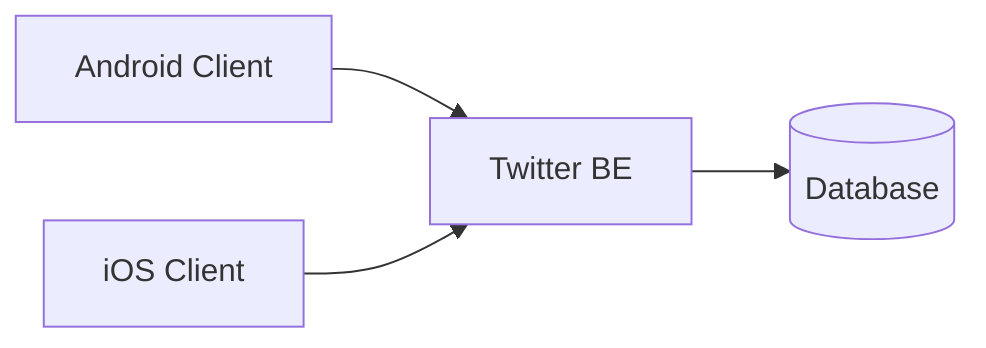

# Twitter for 999 users.

Let's design the backend, storage, and API for Twitter in its early form for 999 users. You'll have a general description of functionality, examples of screen mockups, and some stats about the app that you should use for capacity estimates. Please, keep in mind that provided information is not exhaustive and can be changed later, so your designs and calculations should be flexible enough for sudden changes in requirements.

## General description of functionality:

 - We have 999 users in general, and they all use our app every day.
 - Users can subscribe to other users.
 - Users can create tweets with up to 240 symbols, and emojis are allowed.
 - Users can like, retweet, respond to a tweet, and quote tweets.
 - Every tweet has a page with its content, counters of likes, retweets, quote tweets, and a list of all responses.
 - Every user has a personal page with a list of their tweets and likes.
 - The app has a home screen where users can infinitely scroll all tweets from their subscriptions in chronological order from now into the past.
 - The other screen on the app shows 100 of the most hourly popular tweets from all users. Users can discover people they like and want to subscribe to on this screen.
 - If you want to see or look at how some functionality should work, just look at the actual Twitter, and imagine that the scale would be much smaller)) When in doubt, just ask a question on [bortlogua](https://t.me/bortlogua).

 

## Some stats:

 - All users live in the same country with one timezone.
 - Only 20% of users actively create new tweets, with an average rate of 2 tweets per hour during non-sleeping hours.
 - All users visit our app daily and mostly read other users' tweets, spending, on average, 30 minutes daily, but with peaks during lunch break and evening hours.
 - On average, users click like for 20% of tweets that they read and retweet only 5%.


#### Example of estimates calculation

Lets calculate required storage for users records:

```
(user_id [bytes] + user_name [bytes]) * count_of_users
```

```
(16 [bytes] + 16[bytes]) * 999 = 31968 [bytes] = 31 [KB]
```

#### Example of a system diagram

Please use Mermaid diagrams format, since it is [supported](https://github.blog/2022-02-14-include-diagrams-markdown-files-mermaid/) by GitHub.
For more documentation on Mermaid, go their [website](https://mermaid-js.github.io/mermaid/#/README).




### Week 1:

We will design this system's overall architecture and various aspects in the next few months, but for the first week, let's choose application-level protocol and architectural API building approach. 
Also, we will make rough estimates for future capacity planning and informed architectural decisions.

**Task 1:** Choose a communication protocol for your backend API. 

Examples: REST over HTTP 1.1 with JSON payloads, GRPC, Twirp, SOAP over HTTP, etc. 

Provide a list of pros and cons for the chosen protocol. If you have multiple options, specify the primary option and alternatives with their pros and cons.

Provide an example of a tweet creation API call and response using your protocol.

**Task 2:** Make rough estimates of incoming and outgoing network traffic per day and persecond during peak hours.

**Task 3:** Make rough estimates of the bare minimum required storage capacity for users, subscriptions, tweets, and likes if our system will work for three years.

### Week 2:

**Task 1**: Choose a database for your backend.

Choose database type (key-value, document, relational, etc.) and exact implementation (MySQL, Cassandra, MongoDB...), and provide a list of pros and cons for your choice.

**Task 2**: Design the layout of your database depending on its type. Specify the layout/schema of documents, values, or tables; specify what indexes you will use if applicable.

**Task 3**: Create a sequence diagram and API spec a home screen where users can infinitely scroll all tweets from their subscriptions in chronological order from now into the past. Describe how your backend will fetch necessary data from DB and what queries it will use. What will the complexity of one page fetch be, and how many DB queries will you need for one page?

### Week 3:

**Task 1**: Let's formalize our approach to likes and retweets.

Design and provide sequence diagrams and storage schema for a like.

Design and provide sequence diagrams and storage schema for a retweet.

Describe how to fetch the count of likes and retweets when we fetch the home screen feed. 

Describe how to fetch data to render already liked and/or already retweeted states for the home screen feed.

**Task 2**: Let's do a thing that real Twitter still didn't manage to make and release for all users after all these years: Edits.

You have many options, you can edit in place, but then there is a risk that the author will radically change the content of the tweet after it gets a lot of likes/retweets. A more complex way is to preserve edits' history somehow and still have access to older versions. 

Create a sequence diagram and API spec for tweet edits. Describe storage for edits and how you'll fetch them for individual tweet screens and for feed.

### Week 4:

This week, we will design subjectively one of the hardest features, but we will have very vague requirements, 
so you can decide how sophisticated your design should be.

So, a we need to build a "Trending" page for our app. When users open this "Trending" page, 
they should see an ordered list of topics, words, or phrases that are currently trending on our network. 
Basically, this should be a list of things that people are talking about, liking, and re-tweeting right now. 

Ideally, this list of topics should be personalized for the current user based on their recent likes, 
tweets, or people they follow.

### Week 5:

Original Twitter is going through a very turbulent path, and a lot of users are concerned about the safety of direct messages between users. As you may know, current twitter has no end-to-end encryption, so theoretically, someone within the company can access and read all private messages or even send someone a message in the name of the other person that you trust.

Our app should not be vulnerable to such problems. Let's design storng end-to-end encrypted messaging functionality with open protocol, so even users of alternative apps could send messages to our users if they implement our protocol.

Bonus points if you find a defense mechanism against man-in-the-middle attacks that do not require people to manually compare signatures using another communication channel as Signal and Telegram do.

Additional bonus points if you find a way to replicate end-to-end encrypted conversations to the same account on other devices because some apps do not allow that.
