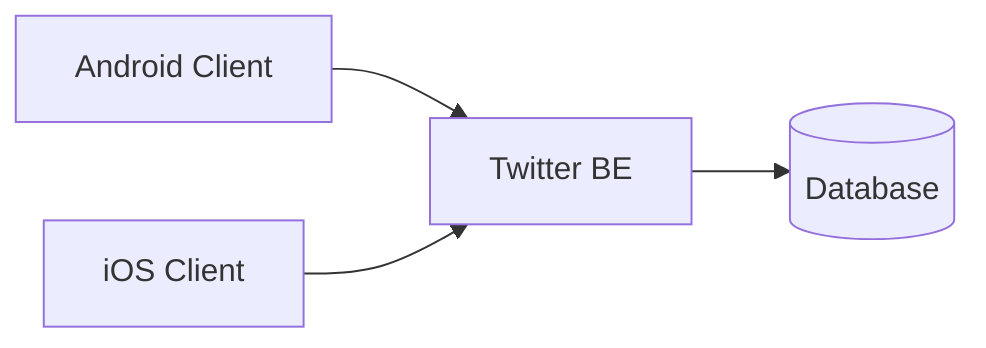
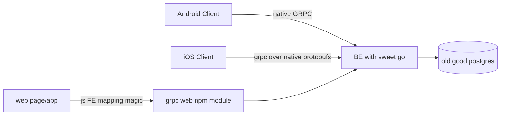

# Twitter for 999 users.

Let's design the backend, storage, and API for Twitter in its early form for 999 users. You'll have a general description of functionality, examples of screen mockups, and some stats about the app that you should use for capacity estimates. Please, keep in mind that provided information is not exhaustive and can be changed later, so your designs and calculations should be flexible enough for sudden changes in requirements.

## General description of functionality:

- We have 999 users in general, and they all use our app every day.
- Users can subscribe to other users.
- Users can create tweets with up to 240 symbols, and emojis are allowed.
- Users can like, retweet, respond to a tweet, and quote tweets.
- Every tweet has a page with its content, counters of likes, retweets, quote tweets, and a list of all responses.
- Every user has a personal page with a list of their tweets and likes.
- The app has a home screen where users can infinitely scroll all tweets from their subscriptions in chronological order from now into the past.
- The other screen on the app shows 100 of the most hourly popular tweets from all users. Users can discover people they like and want to subscribe to on this screen.
- If you want to see or look at how some functionality should work, just look at the actual Twitter, and imagine that the scale would be much smaller)) When in doubt, just ask a question on [bortlogua](https://t.me/bortlogua).

## Some stats:

- All users live in the same country with one timezone.
- Only 20% of users actively create new tweets, with an average rate of 2 tweets per hour during non-sleeping hours.
- All users visit our app daily and mostly read other users' tweets, spending, on average, 30 minutes daily, but with peaks during lunch break and evening hours.
- On average, users click like for 20% of tweets that they read and retweet only 5%.


#### Example of estimates calculation

Lets calculate required storage for users records:

```
(user_id [bytes] + user_name [bytes]) * count_of_users
```

```
(16 [bytes] + 16[bytes]) * 999 = 31968 [bytes] = 31 [KB]
```

#### Example of a system diagram

Please use Mermaid diagrams format, since it is [supported](https://github.blog/2022-02-14-include-diagrams-markdown-files-mermaid/) by GitHub.
For more documentation on Mermaid, go their [website](https://mermaid-js.github.io/mermaid/#/README).




### Week 1:

We will design this system's overall architecture and various aspects in the next few months, but for the first week, let's choose application-level protocol and architectural API building approach.
Also, we will make rough estimates for future capacity planning and informed architectural decisions.

**Task 1:** Choose a communication protocol for your backend API.

Examples: REST over HTTP 1.1 with JSON payloads, GRPC, Twirp, SOAP over HTTP, etc.

Provide a list of pros and cons for the chosen protocol. If you have multiple options, specify the primary option and alternatives with their pros and cons.

Provide an example of a tweet creation API call and response using your protocol.

**Task 2:** Make rough estimates of incoming and outgoing network traffic per day and persecond during peak hours.

**Task 3:** Make rough estimates of the bare minimum required storage capacity for users, subscriptions, tweets, and likes if our system will work for three years.


## Week 1 solution

**Preface:** Судячи з опису (999 юзерів, 1 регіон, відомі/прогнозовані  навантаження по трафіку), наша система не має сенсу бути масштабованою вертикально\горизонтально\локаційно на цьому тижні і загалом може поміститись на одній машині разом з базою (припущення буде доведено нижче).

## **System diagram**
As the diagram in the project description is flawless and (almost) complete :wink: we can keep it after adding some minor features. The project description states that `provided information is not exhaustive and can be changed later` and regardless of feeling that there would be much more users\regions\traffic, for current requirements we can keep current diagram and add layers on top of it later.



## **Task 1:** Choose a communication protocol for your backend API.

**Mobile->BE, FE->BE protocol:** at first I was going to propose most common solution like scheme-less json/REST as "most common" means most people would know the stack means less time to develop & support & there should be tons of ready to use integrations of everything with everything.

But then I briefly googled whether there is big FE/Mobile solutions for schemed binary protocols like GRPC and found that:
* GRPC clients is available on mobile platforms ([android](https://developer.android.com/guide/topics/connectivity/grpc), [ios](https://github.com/grpc/grpc-swift))
* GRPC is also present on web ([js, typescript](https://github.com/grpc/grpc-web))

So we can benefit from binary data compaction, schemes (each model of our system could be represented in strict model, there is no need to have heterogenous json), HTTP/2 whistles under the hood as a bonus. Also GRPC streams could be used for real-time updates in future if there would be need for such things.

The downside of using GRPC as single source of communications between frontends and BE would be the fact that GRPC is not as popular among mobile and FE devs afaik. This would lead for longer dev time on WEB FE and possible lack of ready to use tooling on WEB FE side.

>models could be found here: link
>api calls goes brr


## **Task 2:** Make rough estimates of incoming and outgoing network traffic per day and per second during peak hours.

based on GRPC messages size:
**single tweet author cost (non-detailed)**
```
 - id(postgres uuid is 16 bytes)[16 bytes]
 - handle(lets say 32 alphanumeric chars)[32 bytes]
 - display_name(32 unicode chars, assume unicode char = 2 byte)[64 bytes]
 - verified[1 bytes]
 - avatar(assume old http GET URL length limit 255 chars)[255 bytes]
 TOTAL: 16+32+64+1+256 = 369 bytes
 //@todo: make single binary mask for modifiers like "verified" to save space
```

**single tweet cost:**
```
 - id(postgres uuid is 16 bytes)[16 bytes]
 - Author (calculated above) [369 bytes]
 - created_at (timestamp, no timezone)[8 bytes]
 - likes (int32)[4bytes]
 - quotes (int32)[4bytes]
 - retweets (int32)[4bytes]
 - payload* (240 unicode chars including emoji 👨🏿‍🤝‍👨🏾)[240*4 bytes = 940 bytes]

(16 + 369 + 8 + 4 + 4 + 4 + 940 = 1345 bytes)
```
>*though on payload:
>1. unicode character length can vary from 1 to 4bytes
>2. Emoji can be represented differently regarding implementation and spec version.  Twitter treats single emoji as 2 characters. So payload could contain 240 unicode chars or 120 emoji.
>
> that way longest tweet payload will be 240 *4 bytes (which may differ from actual twitter, which should be less)

**like cost**

```
 - id(postgres uuid is 16 bytes)[16 bytes]
 - type enum [1 bytes]
 TOTAL: 16+1 = 17 bytes
```

**Rough estimates of incoming and outgoing network traffic per day**
lets split traffic in 3 directions: read tweets, write tweets, likes traffic.
1. write tweets:
>up to 20% of 999 users create new tweets, with an average rate of `2` tweets per hour during non-sleeping hours.

lets assume users sleeping 8 hours (like they should, for average person of course)

Max scenario for write per day traffic -- all 20% write:  `[ 999*20% * (24-8) * 2 =~ 640 ]` tweets per day by active users.
`640 tweets for 1345 bytes each gives us flipping 860800 bytes daily, wow!`

2. read tweets scenario. This would be complicated to predict given that api calls differ from one RPC to another.
>-   All users visit our app daily and mostly read other users’ tweets, spending, on average, 30 minutes daily, but with peaks during lunch break and evening hours.

lets assume that user reads 1 tweet in 15 seconds. this would mean user can read
`4*30 = 120 tweets per day`

Read daily traffic for 999 active users scenario would be : `999 * 120 * 1345 bytes = 161238600 bytes =~ 161mb of traffic`

3. likes traffic.
> - On average, users click like for 20% of tweets that they read and retweet only 5%.

`[ 20% * read tweets number + 5% * read tweets number]`
`[ 20% * 120 + 5% * 120 = 30 likes/retweets per day]`
`30 * 17 bytes = 510 bytes of likes traffic per day`


Total traffic per day (maximised everything scenario):
`860800 + 161238600 + 510 bytes = 162099910 bytes =~ 162 mb`

**Rough estimates of incoming and outgoing network traffic per second**
To get absolute peak traffic per second we need to divide daily traffic by 86400:
`162099910 bytes / 86400 = 1877 bytes/second`. This number does not taking into account any peaks, its just average per-day number 🤷🤷🤷


## **Task 3:** Make rough estimates of the bare minimum required storage capacity for users, subscriptions, tweets, and likes if our system will work for three years.

As we already have data for new tweet writes and likes, we can scale it to 3 years instead of day.
`3 years *
860800 (traffic for new tweets per day) + 510 (traffic for likes+shares per day)`
`+ follows traffic (assumed everyone follow everyone to get max peaks estimates. 1 follow = 16 bytes. 16 * 999 = 15984 kb )`

`860800 + 510 * 365 * 3 + 15984(follows) = 943182402 bytes = 944 mb`

🎉🎉🎉

P.S. I never ever successfully passed such numbers-driven system design so don't be harsh plz.

P.P.S. Thank you! I had to binge the whole thing today, but it was very interesting, so I'm very happy.

> Markdown written with [StackEdit](https://stackedit.io/). It supports `mermaid` out of the box 😍😍😍.
