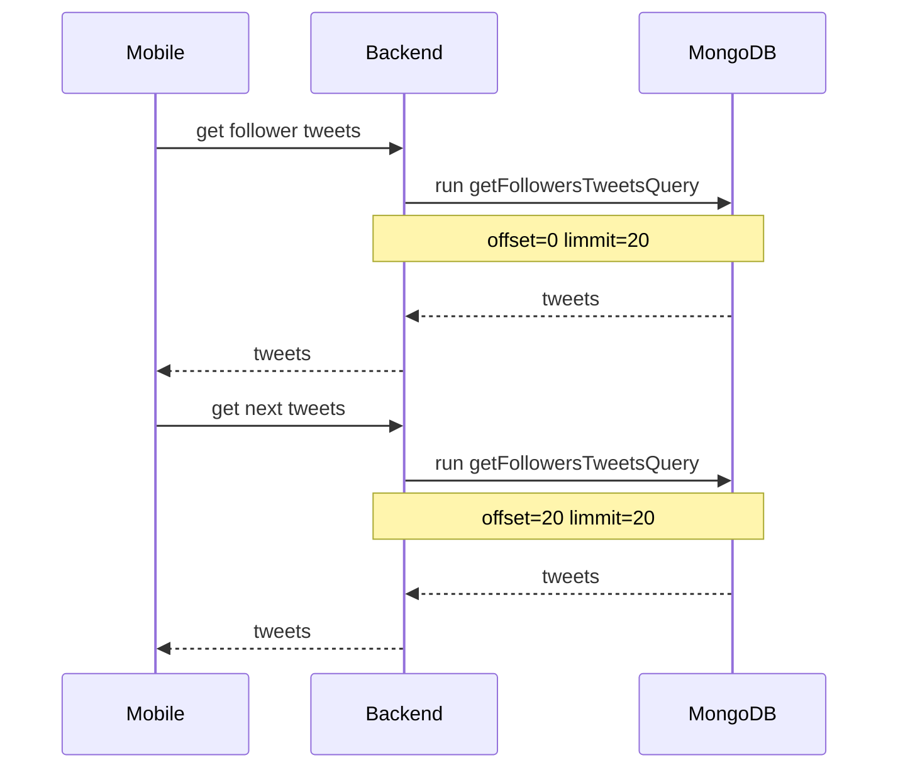

## Week 2

### Task 1

Choose a database for backend.

**What should be the characteristics of the base:**

1. Data in the database will only grow because service does not have data which we can delete.
2. More reading than writing because users read tweets more than they write.
3. It is desirable to have a database with which devs know how to work (deployment DB, write query, knows some subtleties of the database).
4. Since the system has many connections, it would be good if the database had good mechanisms for work with this.

**Let's analyze [CAP](https://en.wikipedia.org/wiki/CAP_theorem) theorem:**

- Consistency - consistency is always good, but our system doesn't mind if some users see inconsistent data, like different number of likes, etc. That's why we can skip this.
- Availability - it cannot be done without, as the user must always be able to read and write tweets. Any unavailability is bad for business.
- Partition tolerance - it would also be great, more service availability. But most users (80%) read tweets, and if, for example master is down, and 20% users won't be able to tweet, it's not that critical for most users. Thats why *Partition tolerance* important for 20% users.

So we can choose **AP** or **CA**

**We choose the type of base:**

* `key-value` - fast databases, well distributed, but the service models are somehow poorly nested on key-value (or I don't have enough knowledge for this), so we reject them.
* `document` - the most popular MongoDB, well supported, there are many experts and large communities.
* `column database` - the most popular Cassandra, the main advantage is that it is distributed by default.
* `relational database ` - popular MySQL, PostgreSQL.
* `graph database` - is the most popular `Neo4j`.

We will choose from the following: Neo4j, PostgreSQL, MongoDB, Cassandra

By CAP theorem
| DB | CAP |
|----|-----|
| Neo4j | CA |
| PostgreSQL | CA |
| MongoDB | AP |
| Cassandra | AP |

**Neo4j VS PostgreSQL**

Since the our service model is well placed on the graph, it will be more convenient to work in Neo4j than in PostgreSQL. But if we [compare performance](https://courses.cs.washington.edu/courses/csed516/20au/projects/p06.pdf) Neo4j loses to PostgreSQL,
Plus PostgreSQL has a bigger community and all developers know SQL, unlike Cypher.

That's why I choose PostgreSQL.

**MongoDB VS Cassandra**
MongoDB has a larger community, so more people know how to work with it.
Cassandra is more distributed, and the read speed is O(1) time. The minus is that it has no join mechanism and transactions, unlike mongodb.

Intuitively, Cassandra is probably better suited, but since I have more experience with MongoDB, then choose it.

**MongoDB VS PostgreSQL**

By CAP theorem for our system AP is more priority than CA because `partition tolerance` more priority than `strong consistency` that's why win MongoDB.

### Task 2

Design the layout of database depending on its type.

```js
// collection: users
{
	"_id": new ObjectId(),
	"username": "some",
	"fullName": "Some FullName"
	"followers": [new ObjectId("632dcf5957d6af5535765a15")]
}

// collection: tweets 
{
  "id": new objectId(),
  "ownerId": new ObjectId("632dcf5957d6af5535765a15"),
  "type": "comment",
  "ref": new ObjectId("123dcf5957d6af5535765222"),
  "text": "cool tweet!",
  "counts": { // will be update counts when do like or coments, etc..
  	"coments": 0,
  	"retweet": 0,
  	"likes": 10
  },
  "createdAt": new Date()
}


// collection: likes 
{
	"userId": new ObjectId("632dcf5957d6af5535765a15"),
	"tweeetId": new ObjectId("632dcf5957d6af5535765a15"),
	"createdAt": new Date()
}

// indexes
db.tweets.createIndex({ownerId: 1, createdAt: -1}) // index by `ownerId and createdAt desc` because we gets tweets from new to old
db.users.createIndex({username: 1}, {unique: true})
db.likes.createIndex({tweeetId: 1, userId: 1}) // for gets who pass like to tweet
```

### Task 3

MongoDB has a powerful functionality, these are [aggregation operations](https://www.mongodb.com/docs/manual/aggregation/), thanks to which you can write one query to get all tweets of followers.

**getFollowersTweetsQuery**
```js
db.users.aggregate([  
    {  
        $project: {"users": "$$ROOT", "_id": 0}  
    },  
    {  
        $lookup: {  
            localField: "users.followers",  
            from: "tweets",  
            foreignField: "ownerId",  
            as: "tweets"  
        }  
    },  
    {  
        $unwind: {  
            path: "$tweets",  
            preserveNullAndEmptyArrays: false  
        }  
    },  
    {  
        $match: {"users._id": {$eq: new ObjectId("632eb91b515a0d6295c4d6f2")}}
    },  
    {  
        $sort: {"tweets.createdAt": -1}  
    },  
    {  
        $project: {"tweets": 1, "_id": 0}  
    },  
    {  
        $skip: 3  
    },  
    {  
        $limit: 3  
    }  
])
```

The chart for gets tweets looks like this:


Therefore, in my opinion, MongoDB is a good choice for our service.
