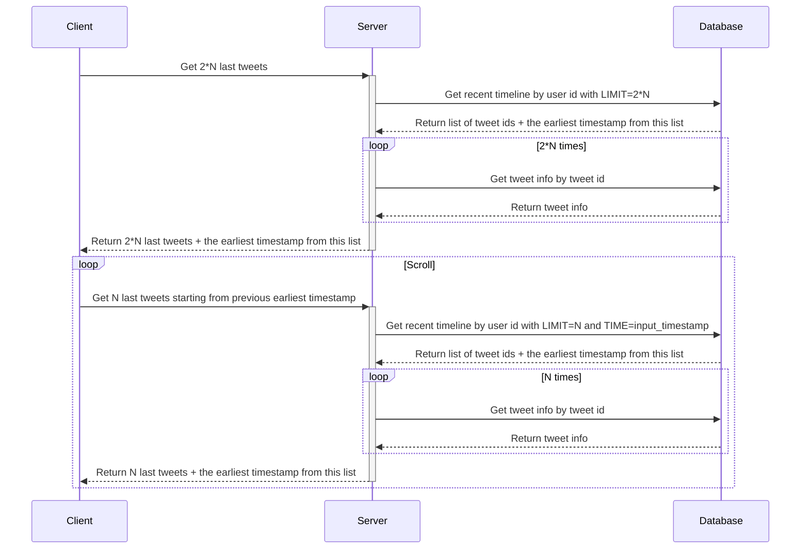

[Initial task](https://github.com/bortlog-systems-design/systems-design/blob/main/README.md)

## Week 2

### Task 1

**Choose a database for your backend.**

#### Abstract idea

To start with, I want to introduce some initial abstract idea about database type.

According to description, we have only **999** users and they are located in the **same country**.

Actually, with such limitations, we can handle all storage with RDBMS like MySQL, Postgres, etc. In adition, we can add cache but it's out of scope for this week.

Such approach does not work well when we would have much more users across different countries. The problem occurs when we need to scale. It's hard to scale RDBMS horizontally in convenient way so we can only scale vertically, i.e. getting a more powerful machine.

But there is a limit to how big a machine you can afford. It fits well for the current amount of data, especially without 10MB media. For the real Twitter scale, it doesn't work IMO.

So, in terms of database type, **I would choose NoSQL database** mainly because of convenient horizontal scaling.

In addition, it's necessary to mention that maintaining high-end RDBMS systems is expensive and needs trained manpower for database management. In contrast, NoSQL databases require less management. It supports many features like automatic repair, easier data distribution, and simpler data models, reducing administration and tuning requirements in NoSQL.

Also, based on statistics, we can state that number of read requests (e.g., get subscriptions, get user feed, get likes) would be much bigger than the number of write requests (such as like post, create a new tweet, save subscribe event).

In terms of the CAP theorem, under network partitioning, a database can either provide consistency (CP) or availability (AP). I believe **we should focus on AP** since we are okay with fetching not always recent data, e.g., fetching the current Twitter feed without a few recent tweets.

Examples of AP databases: Cassandra, Dynamo, CouchDB, Riak, Elastic Search, MongoDB (Replicated).

Since our data is rarely updated, read access is known by a primary key, and there is no need for joins or aggregates, we may want to **use a wide-column datastore**.

#### Choice of storage

Based on previous section, we can propose next storages:
- We can utilize a broad column data store like **Cassandra** for tweets, likes and user data.
- We may utilize a graph-based store solution like **Neo4J** to store entities like user and their followers. But we don't need, at least for now, some complex interaction like "recommend tweet based on common subscribed account or whatever" so we can just store pairs (follower->account) in **Cassandra**.
- Some tweets contain media that is better to store separately. For these needs, we can use **Amazon Simple Storage Service (Amazon S3)** since it's a well known and convenient solution for such tasks.

#### Pros and cons of the chosen storage

Since my main storage is **Cassandra**, I will analyze only it.

**Pros:**

- **Open source:** increases innovation, speed of implementation, flexibility, and extensibility. More cost effective, while avoiding vendor lock-in.
- **Handles a high volume of data with ease:** Built to handle a massive amount of data across many servers.
- **Continuous availability:** _No single point of failure_ means zero downtime. If a particular node fails, users will be automatically moved to the closest working node. The system will continue to work as designed, with applications always available, and data always accessible. Users will never know there was an outage.
- **High performance and fast:** Cassandra has a peer-to-peer, distributed architecture, where every node can perform all read and write operations. This adds resiliency, while improving performance. Write speed is especially fast. And Cassandra can write loads of data, without speed or accuracy being affected.
- **Familiar Interface:** Most developers will be able to pick up Cassandra’s query language quickly. That’s because Cassandra Query Language (CQL) has a strong resemblance to SQL.
- **Straightforward scalability:** Cassandra’s horizontal scaling is straightforward and cost-effective.
- **Seamless replication:** Like other NoSQL databases, Cassandra doesn’t require a fixed schema, making replication simple. And, since it’s a peer-to-peer system, data can be quickly replicated across the entire system, regardless of geographic location. Wide, even global, distribution is possible. Replication across data centers creates high fault tolerance and zero data loss—an outage in any particular region won’t matter. And placing data closer to end users also leads to low latency.


**Cons**:

- **No Support for ACID Properties:** Cassandra does not provide ACID and relational data properties. If you have a strong requirement for ACID properties, Cassandra would not be a fit in that case.
- **No support for Aggregates:** Cassandra does not support aggregates.
- **Joins can be an Issue:** No join or subquery support. You may be able to find a workaround for this one, but that might affect the performance and increase the overhead.
- **Data Duplication:** Data is modeled around queries instead of its structure due to which the same data is stored multiple times.
- **JVM Memory management can be an issue:** Since Cassandra stores vast amounts of data, you may experience JVM memory management issues.


### Task 2

**Design the layout of your database depending on its type. Specify the layout/schema of documents, values, or tables; specify what indexes you will use if applicable.**

Let's start with the `users` table:
 ```sql
CREATE TABLE users (
    user_id uuid PRIMARY KEY,
    user_email text,
    username text,
    date_of_birth date,
    date_joined date
)
 ```

`subscriptions` table has a compound primary key. The first component, the **partition key**, controls how the data is spread around the cluster. The second component, the **clustering key**, controls how the data is sorted on disk. In this case, the sort order isn't very interesting, but what's important is that all followers of a user will be stored contiguously on disk, making a query to lookup all followers of a user very efficient.

 ```sql
 CREATE TABLE subscriptions (
    target_id uuid,
    subscriber_id uuid,
    PRIMARY KEY (target_id, subscriber_id)
)
 ```

Tweets are stored similar to users.

 ```sql
CREATE TABLE tweets (
    tweet_id uuid PRIMARY KEY,
    creator_id uuid,
    creation_time timestamp,
    text_content text,
    like_count varint,
    media_content set<text> // set of content urls
)
 ```

Likes can be stored similar to subscriptions.
```sql
 CREATE TABLE likes (
    tweet_id uuid,
    user_id uuid,
    PRIMARY KEY (tweet_id, user_id)
)
```

The `timeline` table keeps track of what tweets were made and in what order. To achieve this, we use a **TimeUUID** for the clustering key, resulting in tweets being stored in chronological order. The `WITH CLUSTERING ORDER` option just means that the tweets will be stored in reverse chronological order (newest first), which is slightly more efficient for the queries we'll be performing.

```sql
CREATE TABLE timeline (
    user_id uuid,
    time timeuuid,
    tweet_id uuid,
    PRIMARY KEY (user_id, time)
) WITH CLUSTERING ORDER BY (time DESC)
```

### Task 3

**Create a sequence diagram and API spec a home screen where users can infinitely scroll all tweets from their subscriptions in chronological order from now into the past. Describe how your backend will fetch necessary data from DB and what queries it will use. What will the complexity of one page fetch be, and how many DB queries will you need for one page?**

For this task we have 2 types of requests:

- Get tweet by tweet id
  ```sql
  SELECT * FROM tweets WHERE tweet_id=?
  ``` 
- Get feed by user id. Optionally, we can define the start of the timeline.
  ```sql
  SELECT time, tweet_id FROM timeline WHERE user_id_=? [AND time < ?] LIMIT ?
  ```

Let's assume that for the first request we fetch `2 * N` tweets, where `N` is number of tweets per one user screen. For the next requests we fetch `N` tweets per request.

#### API spec (openapi)

```yaml
openapi: 3.0.3
info:
  title: Twitter 999 API
  description: Twitter 999 API
  version: 1.0.0
components:
  schemas:
    TweetId:
      description: Unique tweet ID
      type: string
    UserId:
      description: Unique user ID
      type: string
    ISOTimestamp:
      description: Point in time in ISO 8601 format
      type: string
      pattern: '\d{4}-\d{2}-\d{2}T\d{2}:\d{2}:\d{2}(\.\d{1,3})?Z'
    Tweet:
      type: object
      nullable: false
      properties:
        id:
          allOf:
            - $ref: '#/components/schemas/TweetId'
            - nullable: false
            - readOnly: true
        text:
          type: string
          nullable: false
        media:
          type: array
          nullable: false
        authorId:
          allOf:
            - $ref: '#/components/schemas/UserId'
            - nullable: false
            - readOnly: true
        likeCount:
            type: integer
            nullable: false
        createdAt:
          allOf:
            - $ref: '#/components/schemas/ISOTimestamp'
            - nullable: false
            - readOnly: true
    PageToken:
      type: string
paths:
  '/api/v1/users/{userId}/feed':
    get:
      summary: Get tweet feed for given user
      description: >
         Getting the page with tweets for the user.
         To get the first page (with the most recent tweets), you need to run a query
         without the `page` parameter.
         To get the next page, you need to pass the token of the next page to the `page` parameter,
         received in the response body with the previous page.
      parameters:
        - in: path
          name: userId
          required: true
          schema:
            $ref: '#/components/schemas/UserId'
        - in: query
          name: page
          description: Token of the page
          required: false
          schema:
            $ref: '#/components/schemas/PageToken'
        - in: query
          name: size
          description: Number of tweets per page
          required: false
          schema:
            type: integer
            minimum: 1
            maximum: 100
            default: 10
      responses:
        200:
          description: Page with the most recent tweets
          content:
            application/json:
              schema:
                type: object
                properties:
                  posts:
                    type: array
                    description: >
                      Tweets in reverse
                      chronological order.
                      The absence of this field is
                      equivalent to an empty array.
                    items:
                      $ref: '#/components/schemas/Tweet'
                  nextPage:
                    allOf:
                      - $ref: '#/components/schemas/PageToken'
                      - nullable: false
                      - description: >
                          Next page token, 
                          if available.
                          The field is omitted if
                          the current page
                          contains the earliest
                          tweet in the feed.
        400:
          description: Invalid request, for example, due to an invalid page token.
```


#### Sequence Diagram

`PageToken = earliest timestamp from list of tweets`




**How many DB queries will you need for one page:**
- _Initial fetch:_ `2 * N + 1` DB queries, where `N` is number of tweets per one user screen.
- _Additional fetch during scroll:_ `N + 1` DB queries.

_Ofc, the number of requests can be noticeably decreased by caching, but it seems out of scope for this week._
