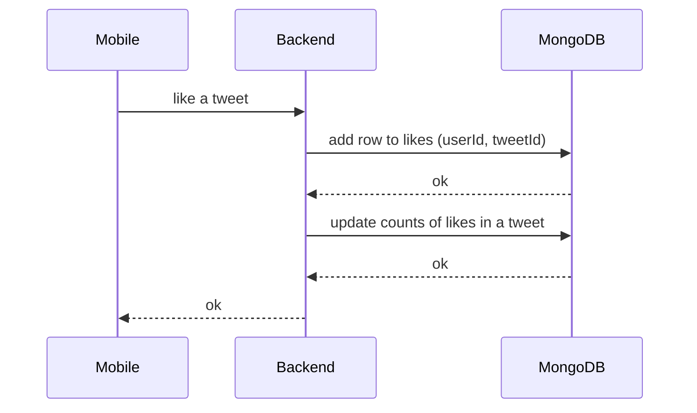
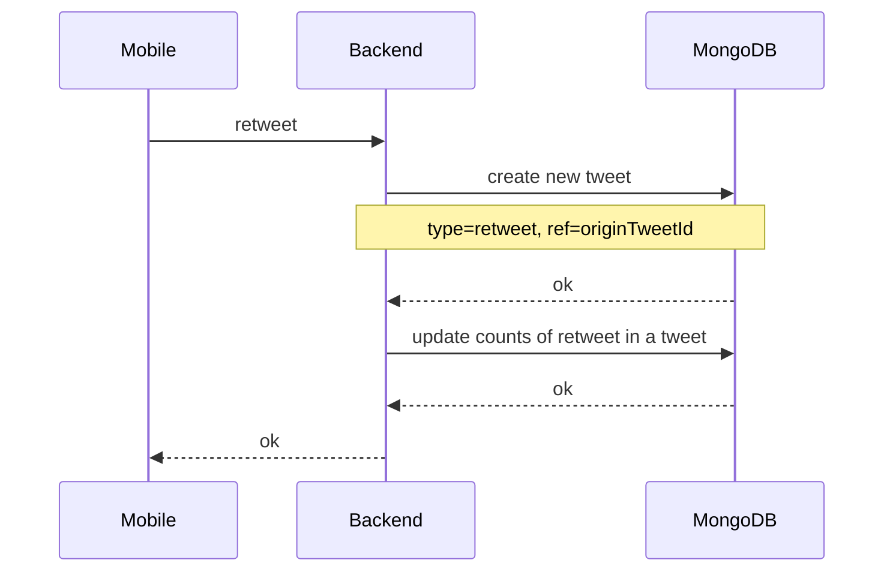
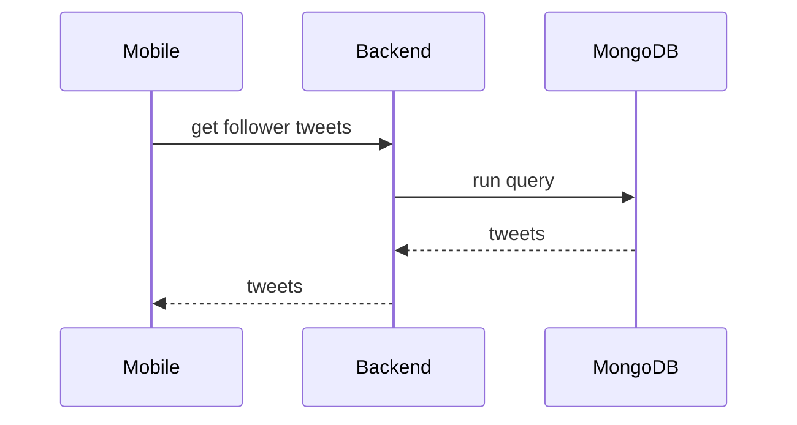

# Week 3

## Task 1

At first, we should choose how we will be work with counts. For example we will be tolk with tweet likes (with retweets the same).
When a user wants to get the number of likes for a tweet, we can:
a. Calculate how many users liked tweet
b. When a user likes a tweet, we can increment count (atomicity) stored in tweet model

Since the database with tweets will always grow, the 2nd method will be more optimal.
In the mongodb, the problem of atomicity when increasing/decreasing the count can be solved using [findAndModify](https://www.mongodb.com/docs/manual/core/write-operations-atomicity/)

How user will be likes a tweet:


How user will be retweet:


Database collections:
```js
// collection: likes 
{
  "_id": new objectId(),
  "userId": new ObjectId("632dcf5957d6af5535765a15"),
  "tweeetId": new ObjectId("632dcf5957d6af5535765a15"),
  "createdAt": new Date()
}

// collection: tweets
{
  "_id": new objectId(),
  "ownerId": new ObjectId("632dcf5957d6af5535765a15"),
  "type": "retweet", // enum[none|comment|retweet|quote]
  "ref": new ObjectId("123dcf5957d6af5535765222"),
  "text": "cool tweet!",
  "counts": { // will be update counts when do like or retweet, etc..
  	"coments": 0,
  	"retweet": 0,
  	"likes": 10
  },
  "createdAt": new Date()
}

// indexes
db.likes.createIndex({tweeetId: 1, userId: 1})
```

Thus, to find that user like tweet or not, we need join two collection (tweets, likes).

// TODO add query to MongoDB for get tweets with isLike bool, using [MongoDB aggregation](https://www.mongodb.com/docs/manual/aggregation/)

## Task 2

I propouse next functional: In retweets, show old tweet content with a label that the tweet has an update, and when click to label user can see new content.

To do this, we will do small changes for tweet model:
```js
[
  {
    "_id": new objectId("1111115957d6af5535765a15"),
    "ownerId": new ObjectId("632dcf5957d6af5535765a15"),
    "type": "none",
    "ref": null,
    "text": { // map[version]text
      "1": "text",
      "2": "updated text"
    },
    "counts": {
      "coments": 0,
      "retweet": 1,
      "likes": 10
    },
    "createdAt": new Date()
  },
  {
    "_id": new objectId("123dcf5957d6af5535765a15"),
    "ownerId": new ObjectId("632dcf5957d6af5535765a15"),
    "type": "retweet",
    "ref": {
      "id": new ObjectId("1111115957d6af5535765a15"),
      "textVersion": "1" 
    },
    "text": null,
    "counts": {
      "coments": 0,
      "retweet": 0,
      "likes": 1
    },
    "createdAt": new Date()
  }
]
```

Thus, the sequence diagram for get tweets is the same from **week2**

