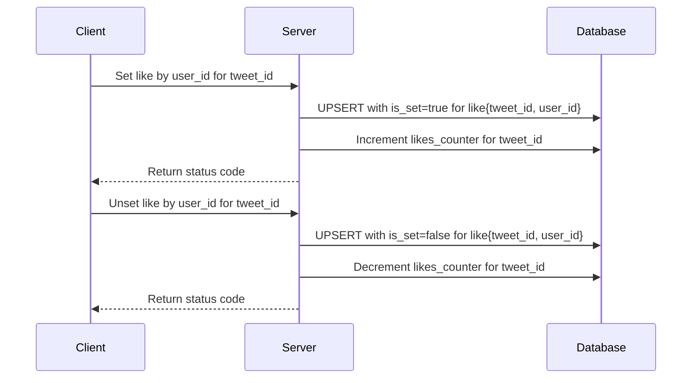
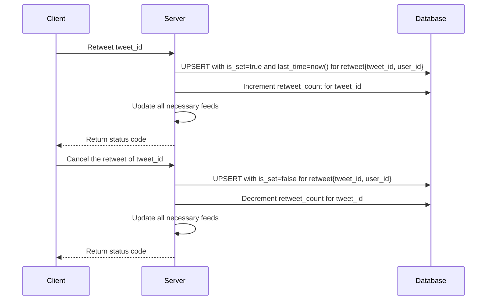
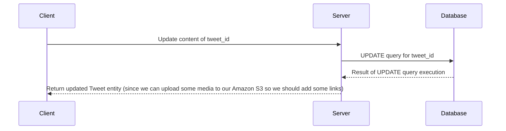

[Initial task](https://github.com/bortlog-systems-design/systems-design/blob/main/README.md)

## Week 3

#### Task 1: Let's formalize our approach to likes and retweets.

- Design and provide sequence diagrams and storage schema for a like.
- Design and provide sequence diagrams and storage schema for a retweet.
- Describe how to fetch the count of likes and retweets when we fetch the home screen feed.
- Describe how to fetch data to render already liked and/or already retweeted states for the home screen feed.

##### Likes

As I mentioned in previous weeks, likes are stored as a pair of `tweet_id` and `user_id`. In Cassandra, it can be implemented as follows:
```sql
 CREATE TABLE likes (
    tweet_id uuid,
    user_id uuid,
    PRIMARY KEY (tweet_id, user_id)
)
```
But how we would fetch the total amount of likes?

In a straightforward approach, we can just count all likes by tweet id.

Then enhance it by caching and a separate table with counters where we will store a number of likes for each tweet. Now this part transforms into _"real time likes/comments counter problem"_, which is a little overkill since we don't need such features as trending/top tweets and don't have such a big number of likes per day.

In my approach, I would just store both likes and re-tweets counters inside of a tweet
```sql
CREATE TABLE tweets (
    tweet_id uuid PRIMARY KEY,
    ...
    like_count counter,
    retweet_count counter,
    ...
)
```
and will update it by some `UPDATE` query like:
```sql
UPDATE tweets
SET like_count = like_count +/- 1
WHERE tweet_id = ?;
```
I believe this approach is good since number of likes in most of the social media apps are _Eventual Consistent_. So we are okay to show not the latest counter. But we saved some simplisity in terms of implementation.

If we unset the like we should decrement `like_count` and `DELETE` entry from `likes` table.

But I believe that it might be not efficient so I would introduce additional boolean flag inside of like entity.
```sql
 CREATE TABLE likes (
    tweet_id uuid,
    user_id uuid,
    is_set boolean,
    PRIMARY KEY (tweet_id, user_id)
)
```
By default it is `true` since we create new record at the moment of the like event.

Seems like it forces us to make two requests to `likes` table when we set a like (since we don't know about previous unset):
```sql
INSERT INTO likes(....) VALUES ... IF NOT EXISTS;

UPDATE likes SET is_set=true WHERE ...;
```

BUT, as I read:
>Cassandra does upsert. Upsert means that Cassandra will insert a row if a primary key does not exist already otherwise if primary key already exists, it will update that row.

So we are okay with only one query per like set/unset!

Sequence diagram for likes will be the next one:



##### Retweets

I am not quite sure how to implement it better by my idea is similar to the likes implementation.

We would store almost the same info as for likes, but with additional field -- time of last retweet:
```sql
 CREATE TABLE retweets (
    tweet_id uuid,
    user_id uuid,
    is_set boolean,
    last_time timestamp,
    PRIMARY KEY (tweet_id, user_id)
)
```
The idea behind this field is to use it for rebuilding feeds after retweeting. Since retweet is shown for other users, we should somehow understand where to put it according to a timeline.

Sequence diagram:


#### Likes/retweets counters and liked/retwitted state

As I mentioned before, counters are stored inside of each tweet. So we don't need to add anything.

With state (liked, retweeted), I have some doubts, but I believe that the good idea is to **use some key-value cache (e.g Redis) to remember the state of each tweet** for the required user and check it in the database on-demand. Such a way might not be so efficient in terms of memory but seems to be easy to implement and maintain.

So when we fetch the information about each tweet, we also need to look up into our cache or execute additional query into a database. After this, we would have all necessary information to render.


#### Task 2: Tweet Edits.

**Create a sequence diagram and API spec for tweet edits. Describe storage for edits and how you'll fetch them for individual tweet screens and for feed.**


Let's start with the User Experience part. I am not a great UX designer but I can suggest two approaches based on other designers opinion:

- After creating a new tweet, give users a 60-90 sec window when they can edit the tweet without any side effects. It might be useful to fix typos or upload missing media attachments. 
- Provide users with ability to edit their tweet whenever they want.  In such case, we have a problem with the risk that the author will radically change the content of the tweet after it gets a lot of likes/retweets. I would solve such problems by a combination of edit history and notifications of users who interacted with original tweet.  


Personally, I would choose the first way with a 60-90 seconds window since it entails less reputation risk and fewer problems with hot users in the future. We don't have so much activity for new tweets, so we can afford to perform edits directly after creation.

If our system grows in terms of traffic, we can add notifications from the second solution.

Approaching a second solution gives more problems than benefits. According to [this article](https://www.technologyreview.com/2022/09/01/1058931/edit-button-fix-twitter-problems/):
> For example, harmless tweets that go viral could easily be edited to later display disinformation or hate speech, and even if the tweet’s previous versions are visible, that doesn’t necessarily mean people will look at them. An edit button would also, in theory, make high-profile users whose tweets garner mass attention even bigger targets for hacking, if bad actors know the tweets are guaranteed a mass audience.

Also, there are numerous cases of Facebook scams related to the ability to edit your post whenever you want.

To implement the first solution I would just edit the original tweet so we don't need an additional schema for edits.

The API spec can be the next one:
```yaml
openapi: 3.0.3
info:
  title: Twitter 999 API
  description: Twitter 999 API
  version: 1.0.0
components:
  schemas:
  ....
paths:
  '/api/v1/tweets/{tweetId}':
    put:
      summary: Tweet Edit
        - in: path
          name: tweetId
          required: true
          schema:
            $ref: '#/components/schemas/TweetId'
      requestBody:
        content:
          application/json:
            schema:
              $ref: '#/components/schemas/Tweet'
      responses:
        200:
          content:
            application/json:
              schema:
                $ref: '#/components/schemas/Tweet'
        404:
        description: >
            No Tweet with such id. 

...  
```


The Sequence diagram:

