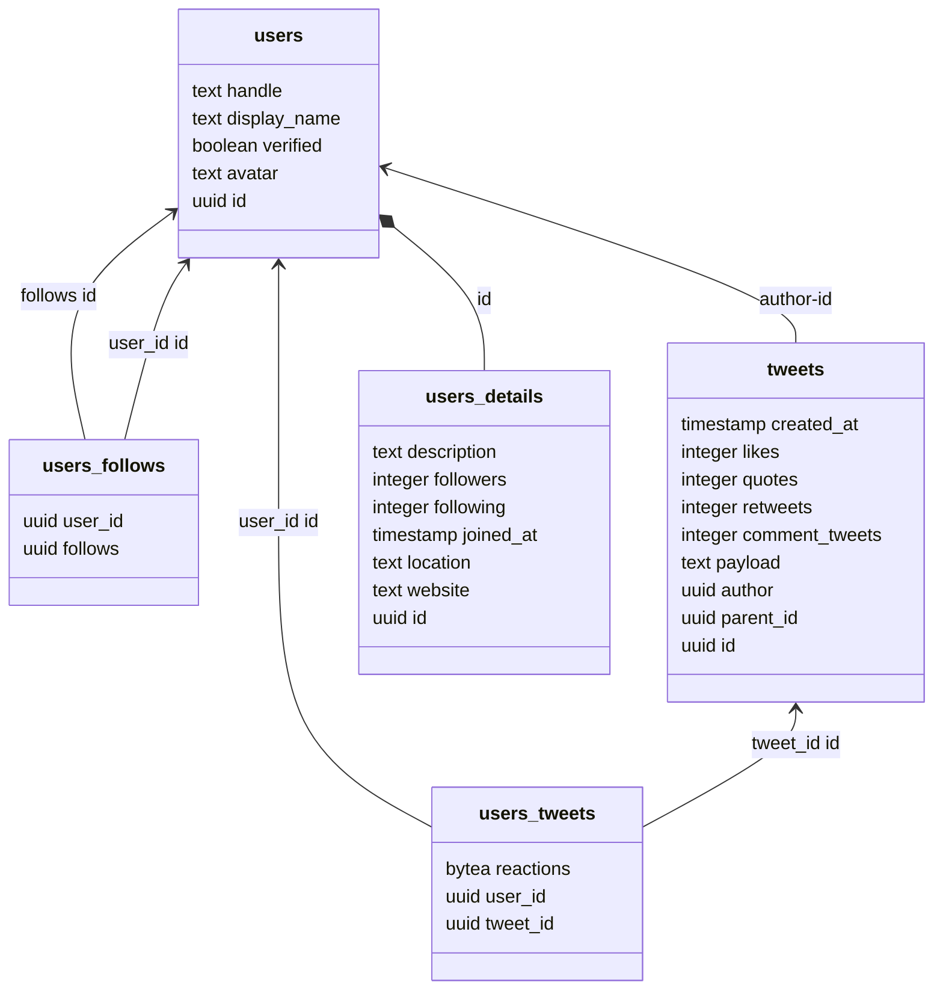
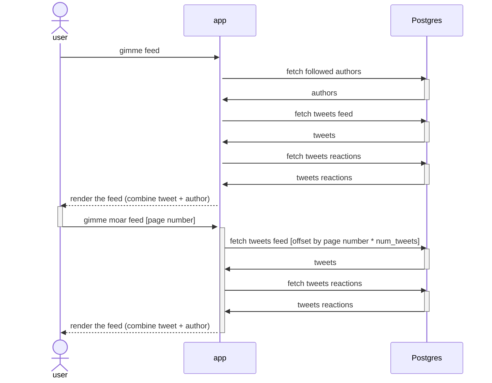
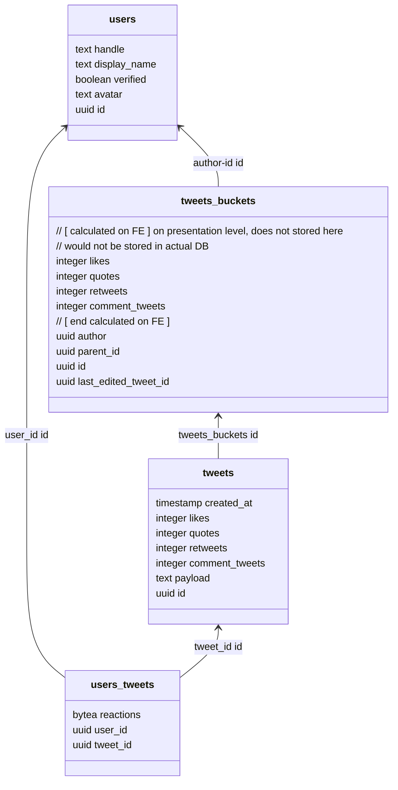

# Twitter for 999 users.

Let's design the backend, storage, and API for Twitter in its early form for 999 users. You'll have a general description of functionality, examples of screen mockups, and some stats about the app that you should use for capacity estimates. Please, keep in mind that provided information is not exhaustive and can be changed later, so your designs and calculations should be flexible enough for sudden changes in requirements.

## General description of functionality:

- We have 999 users in general, and they all use our app every day.
- Users can subscribe to other users.
- Users can create tweets with up to 240 symbols, and emojis are allowed.
- Users can like, retweet, respond to a tweet, and quote tweets.
- Every tweet has a page with its content, counters of likes, retweets, quote tweets, and a list of all responses.
- Every user has a personal page with a list of their tweets and likes.
- The app has a home screen where users can infinitely scroll all tweets from their subscriptions in chronological order from now into the past.
- The other screen on the app shows 100 of the most hourly popular tweets from all users. Users can discover people they like and want to subscribe to on this screen.
- If you want to see or look at how some functionality should work, just look at the actual Twitter, and imagine that the scale would be much smaller)) When in doubt, just ask a question on [bortlogua](https://t.me/bortlogua).

## Some stats:

- All users live in the same country with one timezone.
- Only 20% of users actively create new tweets, with an average rate of 2 tweets per hour during non-sleeping hours.
- All users visit our app daily and mostly read other users' tweets, spending, on average, 30 minutes daily, but with peaks during lunch break and evening hours.
- On average, users click like for 20% of tweets that they read and retweet only 5%.


#### Example of estimates calculation

Lets calculate required storage for users records:

```
(user_id [bytes] + user_name [bytes]) * count_of_users
```

```
(16 [bytes] + 16[bytes]) * 999 = 31968 [bytes] = 31 [KB]
```

#### Example of a system diagram

Please use Mermaid diagrams format, since it is [supported](https://github.blog/2022-02-14-include-diagrams-markdown-files-mermaid/) by GitHub.
For more documentation on Mermaid, go their [website](https://mermaid-js.github.io/mermaid/#/README).

```mermaid
flowchart LR
db[(Database)]
be[Twitter BE]
android[Android Client]
ios[iOS Client]
android --> be
ios --> be
be --> db
 ```


### Week 1:

We will design this system's overall architecture and various aspects in the next few months, but for the first week, let's choose application-level protocol and architectural API building approach.
Also, we will make rough estimates for future capacity planning and informed architectural decisions.

**Task 1:** Choose a communication protocol for your backend API.

Examples: REST over HTTP 1.1 with JSON payloads, GRPC, Twirp, SOAP over HTTP, etc.

Provide a list of pros and cons for the chosen protocol. If you have multiple options, specify the primary option and alternatives with their pros and cons.

Provide an example of a tweet creation API call and response using your protocol.

**Task 2:** Make rough estimates of incoming and outgoing network traffic per day and persecond during peak hours.

**Task 3:** Make rough estimates of the bare minimum required storage capacity for users, subscriptions, tweets, and likes if our system will work for three years.


## Week 1 solution

**Preface:**
As of prerequisites (999 users, 1 region, likely predictable traffic), our system can be non-scalable vertically/horizontally/location-wise (at least on 1st week), and potentially can be deployed on single  machine (hypothesis will be reviewed below).

## **System diagram**
As the diagram in the project description is flawless and (almost) complete :wink: we can keep it after adding some minor features. The project description states that `provided information is not exhaustive and can be changed later` and regardless of feeling that there would be much more users\regions\traffic, for current requirements we can keep current diagram and add layers on top of it later.

```mermaid
flowchart LR
db[(old good postgres)]
be[BE with sweet go]
android[Android Client]
ios[iOS Client]
web[web page/app]
grpc-web[grpc web npm module]
android -- native GRPC --> be
ios -- grpc over native protobufs --> be
web -- js FE mapping magic --> grpc-web
grpc-web-->be
be --> db
```

## **Task 1:** Choose a communication protocol for your backend API.

**Mobile->BE, FE->BE protocol:** at first I was going to propose most common solution like scheme-less json/REST as "most common" means most people would know the stack means less time to develop & support & there should be tons of ready to use integrations of everything with everything.

But then I briefly googled whether there is big FE/Mobile solutions for schemed binary protocols like GRPC and found that:
* GRPC clients is available on mobile platforms ([android](https://developer.android.com/guide/topics/connectivity/grpc), [ios](https://github.com/grpc/grpc-swift))
* GRPC is also present on web ([js, typescript](https://github.com/grpc/grpc-web))

So we can benefit from binary data compaction, schemes (each model of our system could be represented in strict model, there is no need to have heterogenous json), HTTP/2 whistles under the hood as a bonus. Also GRPC streams could be used for real-time updates in future if there would be need for such things.

The downside of using GRPC as single source of communications between frontends and BE would be the fact that GRPC is not as popular among mobile and FE devs afaik. This would lead for longer dev time on WEB FE and possible lack of ready to use tooling on WEB FE side.

>models could be found here: [link](twitter_v1.proto)

## **Task 2:** Make rough estimates of incoming and outgoing network traffic per day and per second during peak hours.

based on GRPC messages size:
**single tweet author cost (non-detailed)**
```
 - id(postgres uuid is 16 bytes)[16 bytes]
 - handle(lets say 32 alphanumeric chars)[32 bytes]
 - display_name(32 unicode chars, assume unicode char = 2 byte)[64 bytes]
 - verified[1 bytes]
 - avatar(assume old http GET URL length limit 255 chars)[255 bytes]
 TOTAL: 16+32+64+1+256 = 369 bytes
 //@todo: make single binary mask for modifiers like "verified" to save space
```

**single tweet cost:**
```
 - id(postgres uuid is 16 bytes)[16 bytes]
 - Author (calculated above) [369 bytes]
 - created_at (timestamp, no timezone)[8 bytes]
 - likes (int32)[4bytes]
 - quotes (int32)[4bytes]
 - retweets (int32)[4bytes]
 - payload* (240 unicode chars including emoji 👨🏿‍🤝‍👨🏾)[240*4 bytes = 940 bytes]

(16 + 369 + 8 + 4 + 4 + 4 + 940 = 1345 bytes)
```
>*though on payload:
>1. unicode character length can vary from 1 to 4bytes
>2. Emoji can be represented differently regarding implementation and spec version.  Twitter treats single emoji as 2 characters. So payload could contain 240 unicode chars or 120 emoji.
>
> that way longest tweet payload will be 240 *4 bytes (which may differ from actual twitter, which should be less)

**like cost**

```

- id(postgres uuid is 16 bytes)[16 bytes]
- type enum [1 bytes]
 TOTAL: 16+1 = 17 bytes

```

**Rough estimates of incoming and outgoing network traffic per day**
lets split traffic in 3 directions: read tweets, write tweets, likes traffic.
1. write tweets:
>up to 20% of 999 users create new tweets, with an average rate of `2` tweets per hour during non-sleeping hours.

lets assume users sleeping 8 hours (like they should, for average person of course)

Max scenario for write per day traffic -- all 20% write:  `[ 999*20% * (24-8) * 2 =~ 6400 ]` tweets per day by active users.
`6400 tweets for 1345 bytes each gives us flipping 8608000 bytes daily, wow!`

2. read tweets scenario. This would be complicated to predict given that api calls differ from one RPC to another.
>All users visit our app daily and mostly read other users’ tweets, spending, on average, 30 minutes daily, but with peaks during lunch break and evening hours.

lets assume that user reads 1 tweet in 15 seconds. this would mean user can read
`4*30 = 120 tweets per day`

Read daily traffic for 999 active users scenario would
be : `999 * 120 * 1345 bytes = 161238600 bytes =~ 161mb of traffic`

3. likes traffic.

> On average, users click like for 20% of tweets that they read and retweet only 5%.

`999 * [ 20% * read tweets number + 5% * read tweets number]` `999 * [ 20% * 120 + 5% * 120 = 30 likes/retweets per day]` `999 * 30 * 17 bytes = 509490 bytes of likes traffic per day`

Total traffic per day (maximised everything scenario):
`8608000 + 161238600 + 509490 bytes = 170356090 bytes =~ 170 mb`

**Rough estimates of incoming and outgoing network traffic per second** To get absolute peak traffic per second we need to divide daily traffic by 86400:
`170356090 bytes / 86400 second = 1972 bytes/second`. This number does not take into account any peaks, its just average
per-day number 🤷🤷🤷

## **Task 3:** Make rough estimates of the bare minimum required storage capacity for users, subscriptions, tweets, and likes if our system will work for three years.

As we already have data for new tweet writes and likes, we can scale it to 3 years instead of day.
`3 years *
8608000 (traffic for new tweets per day) + 509490 (traffic for likes+shares per day)` `+ follows traffic (assumed everyone follow everyone to get max peaks estimates. 1 follow = 16 bytes. 16 * 999 = 15984 kb )`

`(8608000 + 509490) * 365 * 3 + 15984 = 9983667534 bytes = 9983 mb ~= 1 gb`[^1]

[^1]: value is recalculated after week 1 review.

# Week 2:

**Task 1:** Choose a database for your backend.

Choose database type (key-value, document, relational, etc.) and exact implementation (MySQL, Cassandra, MongoDB...),
and provide a list of pros and cons for your choice.

**Task 2:** Design the layout of your database depending on its type. Specify the layout/schema of documents, values, or
tables; specify what indexes you will use if applicable.

**Task 3:** Create a sequence diagram and API spec a home screen where users can infinitely scroll all tweets from their
subscriptions in chronological order from now into the past. Describe how your backend will fetch necessary data from DB
and what queries it will use. What will the complexity of one page fetch be, and how many DB queries will you need for
one page?


## Week 2 solution

## **Task 1:** Choose a database for your backend.

### Considerations on data nature

1. More reads than writes
2. highly volatile relations between users&users and users&tweets

We can think on different approaches while picking storage for twitter:

1. create personal "stream" for each user -- writes would
   be [fanned-out](https://en.wikipedia.org/wiki/Fan-out_(software)) to each user who follows tweet's author on every new tweet
2. go classical SQL relational way - each entity would go to separate SQL table, relations between users would be represented by intermediate `many-to-may` tables
3. try to represent data as a graph using graph database - we would benefit for easiness of linking every entity to any other entity

#### 1. partitioned from the start approach

This solution would be way to go for larger systems as it would require more knowledge of engineers working on tasks, it would cost higher in money and operational resources. Example of such DB would be `Cassandra` which is distributed column database. My experience with cassandra is limited yet in my opinion we can create "column" for each user and "push" new tweets directly there. This way personal page for user and different "slices" of tweets views would be consistantly fast to read. Drawback would be "eventual constistency" introduced by fan-out and cassandra internal syncing nature.

#### 2. relational (sql) approach

Well this is most used approach still in 2022. As a SQL db we can take `postgres` as most known sql db by author.

Pros:

* knowledge barrier is low (everybody know SQL out of the box)
* tooling (ready to use data mappers, ORMs, drivers, generators)
* high consistency powered by foreign key relations
* transactional
* scales ok vertically (jsut throw some Franklins $$$ onto a cloud, and you're good for some period of time)

Cons:

* becomes slower when becomes larger
* transactional (writes can become slow eventually)
* scales horizontally not so good on large datasets (too much Franklins $$$ had being thrown already, and ~*now*~ you
  realise we need something completely different. "Now" like "yesterday-now".)

#### 3. graph database

A of my knowledge on graph DBs are limited (I worked with neo4j once) I would review only neo4j features here.

Pros:

* by the graph nature and graph relations in particular we can easily link and unlink entities. This gives us few
  features:
    - write operations on likes\follows would be extra cheap
    - read operations would give us just right amount of data that we need (data is not rectangular)
* we can build very powerful recomendation system based on "closeness" of graph nodes. Something which would make our
  system beyond current tweeter capabilities
  Cons:
* very hard to create proper "order by date" functionality without recreating of what we have in sql and using
  unspeakable amount of db code
* very limited tooling
* very low chance of the team members to have hands on experience with graphs

### DB Choice

So given with small size of the system even on 3 years of operations we can skip cassandra as redundant. Also, we can
skip neo4j as most of our data would be ordered by time. This would lead us to `postgres` which would be good candidate
for our small system.

## **Task 2:** Design the layout of your database depending on its type.

SQL tables structure could be found [here](sql.sql)

Here is "dumb" solution which would cause not much of a problem for our scenario (999 users, single node, still trying
to fit everything on single machine).

Things to consider: partitioning. Postgres supports partitioning out of the box (minimal version of pg with this feature
is postgres 10 which is going to be deprecated in a month).

> @todo1:We would need to partition tweets table by each user's followed authors mimicking that way the "cassandra" solution from task 1. Yet we need to tackle what to do if user starts/stops to follow someone - should we re-create partition?

> @todo2: we can try to partition differently, lets say by date. So we can create partition for each day or other relatively small period of time, thus we would reduce the dataset to search tweets from. But then we can have situation when we will query lots of partitions in a vain because the authors we need wrote old tweets only. Thus, this method is very unreliable.



## **Task 3:** Create a sequence diagram and API spec a home screen

> Home screen where users can infinitely scroll all tweets from their subscriptions in chronological order from now into the past. Describe how your backend will fetch necessary data from DB and what queries it will use. What would be the complexity of one-page fetch, and how many DB queries will you need for one page?

By our scheme to fetch main screen we would need to run at least three queries:



1. **fetch all of current user's authors to cache them in the app.** We can join them to each tweet later on, at the BE<->FE communication level.

```sql
select u.*
from users_follows uf
         join users u on u.id = uf.follows
where user_id = ?;
```

It would be of cost 0..998 in composite index of `users_follows` which should be blazing fast. Then we can keep those
IDs in some cache in our app.

2. **We need to fetch the tweets feed**. We will "paginate" by modifying offset of number tweets to query multiplied by page. This approach is not optimal as we would need to go through `created_at` index until we satisfy offset condition and then throw away part of the result.

```sql
select t.*
-- now we have only the fields which we need to display on "list of tweets" component
from tweets t
where t.author in ('authors uuids')
order by t.created_at DESC
limit 20
-- optional "load more paginator"
-- [ offset "page" number * 20]
;
```

The cost of this query would be (in order of execution) :
- Scan index scan on `author` column
- sort by `created_at`
- limit results
- offset results

Or, in explain format:
```
Limit  (cost=11.31..11.32 rows=1 width=24)
  ->  Sort  (cost=11.31..11.31 rows=3 width=24)
        Sort Key: created_at DESC
        ->  Bitmap Heap Scan on tweets t  (cost=4.17..11.28 rows=3 width=24)
              Recheck Cond: (author = 'UUID'::uuid)
              ->  Bitmap Index Scan on tweets_author_idx  (cost=0.00..4.17 rows=3 width=0)
                    Index Cond: (author = 'UUID'::uuid)
```


3. **fetch user's reaction on tweets we just found.** If we join reactions to prev query that would be more slow than just fetch by ids as there would be no `tweet -> tweet_reaction_by_tweet_id` loop on one of the query planning steps.

```sql
select * from users_tweets
where user_id = 'user_uuid' and tweet_id in ('tweet_uuid');
```

Cost would be regular index cond scan.


**Conclusion:**
That's all for now. The actual numbers of costs can be calculated with numbers from the week 1.

## [Week 3:][week3]

**Task 1**: Let's formalize our approach to likes and retweets.

Design and provide sequence diagrams and storage schema for a like.

Design and provide sequence diagrams and storage schema for a retweet.

Describe how to fetch the count of likes and retweets when we fetch the home screen feed.

Describe how to fetch data to render already liked and/or already retweeted states for the home screen feed.

**Task 2**: Let's do a thing that real Twitter still didn't manage to make and release for all users after all these years: Edits.

You have many options, you can edit in place, but then there is a risk that the author will radically change the content of the tweet after it gets a lot of likes/retweets. A more complex way is to preserve edits' history somehow and still have access to older versions.

Create a sequence diagram and API spec for tweet edits. Describe storage for edits and how you'll fetch them for individual tweet screens and for feed.


## Week 3 solution

>clearly if we are going to introduce "multi-versioning" of a tweet, we need to complete secod task before first one. Multi-versioning probably would affect the likes/retweets mechanisms. Lets take a look.

## **Task 2:** Edits for tweets.
As noted before, editing the tweets may bring complexity both UX-wise and backend-wise.

### reasoning behind edits
**Why we need editing?** to design edits of tweets we need to understand the reason why do we want to do it. My thoughts on this are next:
we want to be able to edit to correct mistakes which was there while tweet was submitted.

I will take as reference the tweet from ex POTUS and most orange person ever:
```
Donald J. Trump
@realDonaldTrump
Despite the constant negative press covfefe
May 30, 2017
```

Let's think what would happen if this message would be edited:
1. it will contain actual information author was intended to tweet
2. it would make people who already liked it for "covfefe" people who just supports Trump
3. it would make new viral meme "covfefe" completely disappear from twitter

In my opinion to keep "truth" and also prevent users from being fooled we need to tackle all 3 of this scenarios.

Let's think about possible approaches:
1. **replacing original text + marking tweet as "edited"**. This approach does not cover 2,3.
2. **accumulate and show all the edits of tweet**. This covers 1,3 but not 2 (kind of).
3. **accumulate and show all the edits of tweet + link the reactions to specific edits**. This way we can have 1,3 and 2 - memers would have "covfefe" on their feeds, and tump-lovers would have edited version.

I would pick as solution third approach. Let's think how it would look like.

### reasoning on UI/UX
As mentioned before, for personal feed of user we would see the tweet version the person liked\retweeted\reposted. But what to do with potus feed? **Displaying all the versions at once would make twitter complex**, and one of the **most valued feature of Twitter is easiness and intuitivity**.
So we need to display just single tweet but show the indicator that tweet has multiple versions.


[tweet edited 3 times on the author's feed. Before, after edit]

### which version to show on authors page
The edited tweet on author's page should show the latest edit, but to prevent the edited tweets would get all the credits for unedited tweet, we need to make sure the tweeter user would understand that prev version was way more popular. So we can highlight with bright color the tab which gone viral (whether to highlight we can decide on FE - if prev version has more likes/retweets among other versions - we need to highlight it).

Also, we would need to add second non-clickable panel to show all counters for current tweet. Otherwise, we would make users to like/retweet whatever they see on first tweet load, which would be last edited tweet.

**Important note:** we would have to change comments branches as well when we change "tabs" of tweets as users are replying to tweets, not tweet agregate.


[one of the versions got more popular than last edited + most popular tab clicked]


### backend architecture considerations
Backend-wise we need to decide how keep current performance on writes\reads without dealing with "fetch also neighbour records to rank them to find latest"
With the concept of having multi-versions with own reactions relations we would want to create a new table.



**"Get feed"** query now would look like this (by default we display last edited, sorting on FE side, tweet_bucket counters (likes, retweet) too)
```sql
-- fetch tweets feed
select tb.*, t.*
from tweets_buckets tb
  left join tweets t on t.tb_id = tb.id
where tb.author in ('authors uuids')
order by tb.created_at DESC
-- @todo keyset pagination here
```


**"get individual tweet"** query would be next:
```sql
select tb.*, t.*, tb2.*, t2.*
from tweets_buckets tb
       left join tweets t on tb.id = t.tb_id                 -- find tweets of bucket
       left join tweets_buckets tb2 on tb.parent_id = tb2.id -- replies tweet_buckets
       left join tweets t2 on t2.tb_id = tb2.id              -- replies tweets
where tb.id = 'desired_tweet_id'
  AND t.id = tb.last_edited_tweet_id;
```

### Thoughts on optimization
In this approach we are fetching all the variants of needed tweets in both scenarios.
We do that to get the summarized counters for each bucket to represent them in "non-clickable" footer as stats. So we need to decouple the reactions from tweets in a way to avoid writing counters in 2 different places each time when we need to update them (tbd)

## **Task 1:** Let's formalize our approach to likes and retweets.

As likes/retweets was already considered in my Week1 and Week 2 solutions, and Task 2 of this week is not affecting likes\retweets I consider this task as done. Please take references from previous weeks submissions.

> Markdown written with [StackEdit](https://stackedit.io/). It supports `mermaid` out of the box. Try it (dont forget to
> paste markdown by [ctrl+shift+v] )
