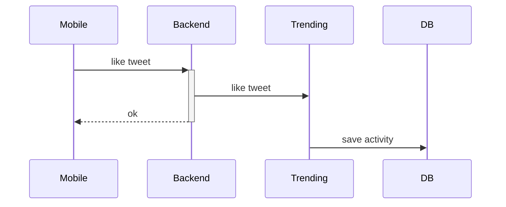
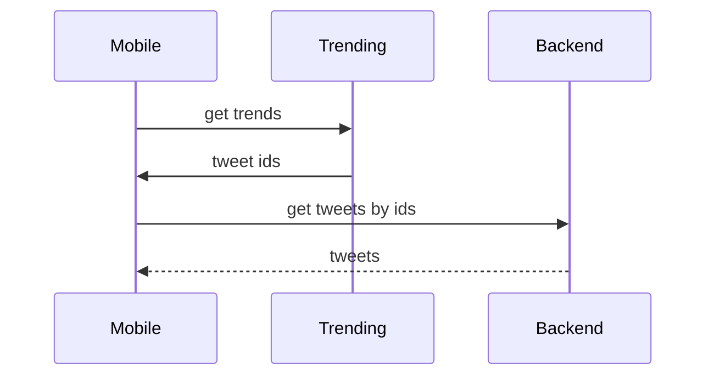
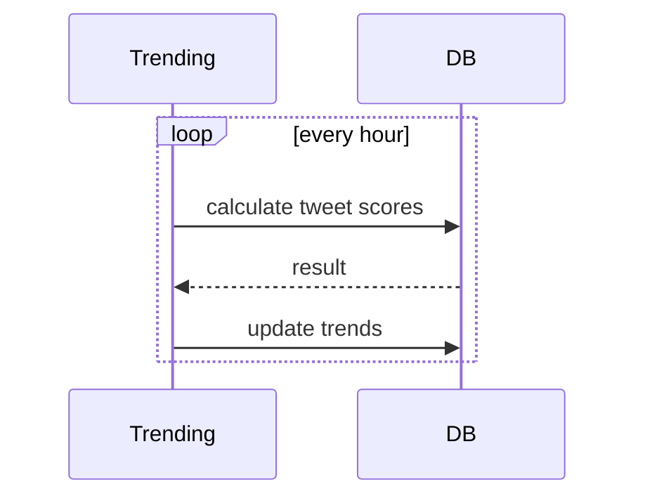

## Week 4

We are developing a trending page for Twitter. As a user,
I would like to see the trends of the day in my geolocation.
But since we have a system in one geozone, we will ignore the location for simplicity.

We will calculate the popularity of a tweet as follows:
```
score = average( arrayPerCurrentDay( sum(likes, retweets, quote) per hour ) )
```

To begin with, we will measure `per hour`, but in the future it will be possible to play
with this value, it may be better `per 10 minutes` or another duration.

Diagram of how tweet activity will enter the new `Trending` service.
Let's consider an example with a like. It will be similar for retweets and quotes.



Diagram how Mobile knows which tweets are currently trending:



**Trending service API**
```http
### Tweet activity capture
POST /events/

{
  "tweetId": "507f1f77bcf86cd799439011",
  "type": "like",
  "timestemp": 1665739941
}

### Get trends tweet ids
GET /trends

Responce:
[
	"507f1f77bcf86cd799439011",
	"123f77bcf86cd799439011"
]
```

For simplicity, a new event will be send via a REST.
Although for the future I think it is worth adding an event bus (RebbitMQ, Kafka, NATS?)
because the like event is useful, and other future services may also need it.

**Which DB choose?**

Since we already have MongoDB, we need to find out whether it will be suitable for our task.
Appeared with MongoDB 5.0 has [time series data](https://www.mongodb.com/features/mongodb-time-series-data).
This thing is just a good fit for our task.

Documents:
```js
// create time series collection
// for tweets activity
db.createCollection("tweets_activity",
    {
        timeseries: {
            timeField: "timestamp",
            metaField: "metadata",
            expireAfterSeconds: 86400 // events was deleted after 24 hour
        }
    }
);

// example activities
db.tweets_activity.insertMany([
    {
        "metadata": {
            "tweetId": new ObjectId("507f1f77bcf86cd799439011"),
            "type": "like"
        },
        "timestamp": ISODate("2022-05-18T10:10:00.000Z"),
    },
    {
        "metadata": {
            "tweetId": new ObjectId("507f1f77bcf86cd799439011"),
            "type": "retweet"
        },
        "timestamp": ISODate("2022-05-18T10:10:00.000Z"),
    },
    {
        "metadata": {
            "tweetId": new ObjectId("507f1f77bcf86cd799439011"),
            "type": "quote"
        },
        "timestamp": ISODate("2022-05-18T10:11:00.000Z"),
    }
]);

// collections tweet trends per day
db.trends.insertMany([
    {
        "tweetId": new ObjectId("507f1f77bcf86cd799439011"),
        "score": 123
    },
    {
        "tweetId": new ObjectId("1237f1f77bcf86cd799439011"),
        "score": 58
    }
])
```

The `trending` service will list tweet trends once an hour:


MongoDB query for calculation of tweet scores according to the formula:
```js
db.tweets_activity.aggregate([
    {
        $project: {
            date: {
                $dateToParts: {
                    date: '$timestamp'
                }
            },
            tweetId: '$metadata.tweetId'
        }
    },
    {
        $group: {
            _id: {
                date: {
                    year: '$date.year',
                    month: '$date.month',
                    day: '$date.day',
                    hour: '$date.hour'
                },
                tweetId: '$tweetId'
            },
            active: {$sum: 1}
        }
    },
    {
        $group: {
            _id: {
                date: {
                    year: '$_id.date.year',
                    month: '$_id.date.month',
                    day: '$_id.date.day'
                },
                tweetId: '$_id.tweetId'
            },
            score: {$avg: '$active'}
        }
    }
]);
```