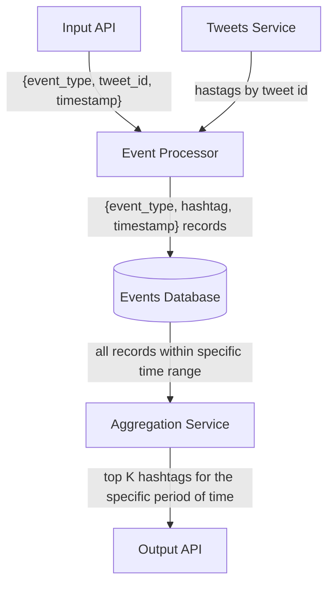
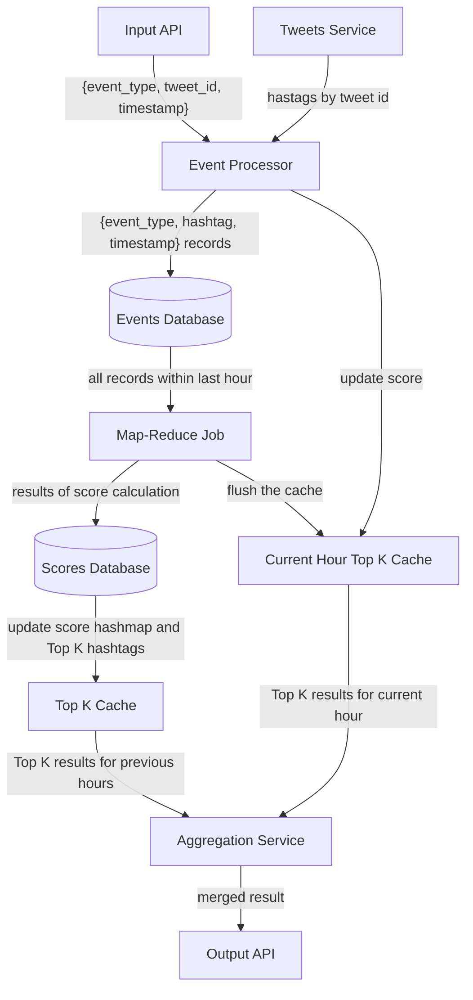
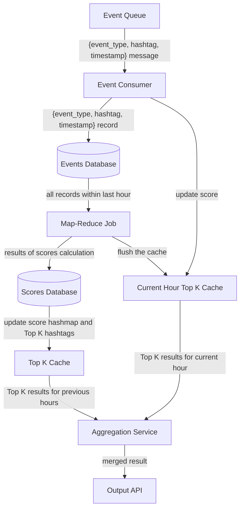

[Initial task](https://github.com/bortlog-systems-design/systems-design/blob/main/README.md)

## Week 4

This week, we will design subjectively one of the hardest features, but we will have very vague requirements, so you can decide how sophisticated your design should be.

So, a we need to build a "Trending" page for our app. When users open this "Trending" page, they should see an ordered list of topics, words, or phrases that are currently trending on our network. Basically, this should be a list of things that people are talking about, liking, and re-tweeting right now.

Ideally, this list of topics should be personalized for the current user based on their recent likes, tweets, or people they follow.

### Abstract idea

Since we want to show the ordered list of limited size (in real Twitter we see 5-20 trending topics), and order is defined by some metrics (e.g, any interactions per hour), this problem can be interpreted as **Top K Problem (Heavy Hitters)**.

Before the start, we need to decide what we should display on a "Trending" page. I would suggest displaying trending hashtags since it's quite easy to parse tweet content to get the list of hashtags.

Another option is to display some trending words/phrases, but it would require setting a filter for "common" words like "a", "the", "and" and so on. But I think that it's off-topic for our task.

When a user clicks on any hashtag from the trending list, we can fetch a specific feed-per-hashtag, similar to what we did the previous week. But I suggest pre-building this feed only for trending hashtags containing the tweets from the time frame of the last N hours.

To sort hashtags, we need to have a "trending score" for each hashtag. I suggest that each interaction contributes to this score but with different weights. E.g.:

- Creation of a tweet with hashtag A: +40 points
- Like a tweet with hashtag A: +10 points
- Retweet a tweet with hashtag A: +20 points
- Commenting/Quote of a tweet with hashtag A: +15 points

Then we need to get **K** hashtags with the biggest scores and fetch all tweets in order to pre-build feeds.

Additional features, like "list of topics should be personalized for the current user based on their recent likes, tweets, or people they follow" will be discussed in the ["Bonus" section](#bonus) if I would have time to do it :)

### Introduction

Firstly, let's define functional and non-functional requirements for our system.

**Functional Requirements:**
- Users should be able to see the top K trending hashtags in the last 24 hours. Value **K** can be dynamically updated and/or the time interval can be updated from 24 hours to say 1 hour and so on.

Basic API:
```java
List<Hashtag> getTopHashtags(K, startTime, endTime);
```

**Non Functional Requirements:**

- Need not be strongly consistent i.e. eventual consistency
- Results could be approximate but with a very less error rate.
- Results should be returned with a very low latency.
- System should be highly available.

Secondly, let's start with some **basic high level architecture**.



The flowchart above describes the basic logic of our system.

Our system receives events via `Input API` (likes, tweet creation, retweets, etc.). `Event Processor` receives this event and fetches the list of hashtags for a specific tweet (we receive `tweet_id` inside the event) by requesting a specific "external" service. We assume that hashtags are parsed during the tweet creation so we can get them fast from the main part of the Twitter-999 system.

After it, `Event Processor` creates new event for each hashtag from requested list. And they are stored in `Event Database`.

The most interesting part is the `Aggregation Service`. This service requests all events in the specified time range and calculates a score for each hashtag. Then, based on these scores, we can find top K hashtags and send them to the `Output API`.

Several ways to implement `Aggregation Service` are described in [this section](#how-to-get-the-top-k-hashtags).

### Expected number of events and hashtags

Let's try to calculate the approximate number of events and hashtags.

From the first week, we know that our system receives:
- `6 000` new tweets per day
- `36 000` likes per day
- `9 000` retweets per day

Also, we know that users can comment on the tweet, but we don't have any statistics.

Based on that, we can assume that, during the day, we can expect `55 000` events that might be related with the hashtags.

[Recommended number of hashtags per post](https://help.twitter.com/en/using-twitter/how-to-use-hashtags) in the original Twitter is `2`.
> Technically, you can use as many hashtags as you like in a Tweet, within the 280-character limit. But Twitter recommends using no more than two.

So we can expect `12 000` hashtags per day. Assuming that `30%` of hashtags are unique, the number of unique hashtags per day is `3600`.

These numbers are relatively small and can be handled with a system much simpler than I gonna present below. But let's assume that we want to handle much much bigger numbers of events and hashtags.

### Events Database

As basic storage, I have **Events Database**. This database stores raw events.

There are several intentions for storing the raw events:
- it can be used for advanced features like personalized lists for the current user based on their recent likes, tweets, or people they follow.
- it might be useful for the statistics/analytics features in future.
- if we store aggregated data, it would be hard to fix errors.
- if we want to change the parameters of calculations (e.g. change coefficients of events, number of top hashtags, or time ranges), it would be nice to have the raw data.

We can use a NoSQL database such as Cassandra to store the hashtags along with the timestamp with a schema something like `(event_id, event_type, hashtag, timestamp)` with the `event_id` as the partition key and the `timestamp` as the range key so that the data is sorted by timestamp.

In order to deal with the failure of a single node, we will have a Cassandra cluster such that the same data is replicated across all the several nodes for redundancy. This ensures high availability.

We can choose to go ahead with asynchronous replication for our cluster since our requirement was eventual consistency.


### How to get the top K hashtags?

#### Naive approach -- In-Memory calculation

The most simple approach is to solve **Top K Elements Problem** on each request with a help of **Heap + Hash Map**.

It can be implemented similar to the code below:

```java
class Solution {
    private Repository db;

public List < Hashtag > getTopHashtags(int k, Timestamp startTime, Timestamp endTime) {
    List < Record > relevantRecords = db.getAllRelevantRecords(startTime, endTime);

// O(N) time
Map < Hashtag, Integer > score = new HashMap();
for (Record r: relevantRecords) {
    switch (r.event) {
        case Event.CREATE:
        points = 40;
        break;
        case Event.LIKE:
        points = 10;
        break;
        case Event.RETWEET:
        points = 20;
        break;
        default:
        points = 15;
        }

score.put(r.hashtag, score.getOrDefault(r.hashtag, 0) + points);
}

Queue < Hashtag > heap = new PriorityQueue < >((left, right) - >score.get(left) - score.get(right));

// O(N log k) < O(N log N) time
for (int s: score.keySet()) {
    heap.add(s);
    if (heap.size() > k) heap.poll();
    }

// O(k log k) time
Hashtag[] top = new Hashtag[k];
for (int i = k - 1; i >= 0; --i) {
    top[i] = heap.poll();
    }
    return top;
    }
    }
```

This solution has two significant drawbacks:

- **Not durable.** If the aggregation service crashes or restarts all calculated data will be lost.
- If K or timerange is too big (e.g. we want to find the top 10000 tweets during 200 days), then **we might reach the RAM limitations**.
- **Not effective** since we need to make all these calculations from scratch on every new request (I mean the new time range). It doesn't meet our latency expectations from non-functional requirements.

#### Improvements of naive solution

Our previous solution has one way to improve -- we should make it distributed and scalable.

To achieve this, we can make the next steps separately, not in the one part of our system:

- improve score calculation
- improve answer computation


##### Running Jobs to accumulate hashtag scores

To improve score-per-hashtag calculation, we can use regular map-reduce jobs.

Basically, in each `map` part we calculate the score for each hashtag in some subsets of events using Hashmap and then, in `reduce` part, we merge N hashmaps just by summing up corresponding scores.

So we can run Spark jobs every hour to fetch data from Cassandra and calculate the score for each hashtag and store these results in another database such as MySQL and also in an in-memory cache such as Redis.

As I mentioned in the previous sentence, we can store score-per-hash in Redis cache because the scores will not get updated for a period of 1 hour.

But now we have one noticable problem -- there could be certain hashtags which is trending in the last 20–30 minutes and those scores will not be updated before an hour.

It can be simply improved by a separate Redis service that will store all scores per last non-finished hour. When current hour is finished and the regular Spark job is done , we flush this cache.

Whenever the event is ingested through API, apart from being written to Cassandra, it is also written to the separate Redis hashmap and the score is updated on a fly.

Now for computing the scores of the hashtags in the last 24 hours, apart from making an SQL query we also query the Redis hashmap. Take the sum of the scores for each hashmap from SQL query and Redis. In this way we can have the most up-to-date score for each hashtag.

P.S. As follow-up, we can also think about applying some probabilistic data structures like **Count Min Sketch** instead of Hash Map. It may save some memory and make the merge operation quite easier. But it affects the accuracy of our answer since it returns approximate results. I don't have experience with this data structure and don't see any important reasons to apply it.

##### Computing Top K hashtags by scores

In the Redis caches where we are storing the scores for previous and current hour, we also maintain a Min-Heap priority queue of size K i.e. it stores the K most popular hashtags.

The "current hour" heap can be updated with streaming data in `O(logK)` time complexity.

Another heap can be created with `O(N logK)` time complexity, where `N` is the number of unique hashtags. If `N` is big then we can create several caches and distribute all hashtags among them.

Since we have at least two caches for storing Top K hashtags, we need to combine the results into one list of size K. For this we can use **merge sort** or **merge N sorted lists** algorithm.

This work can be done by `Aggregation Service`.

### Improved pipeline



### Improved Event Processor

In my opinion, current `Events Processor`  is little bit overloaded:

1. it receives events which needed to be transformed into `event-per-hashtag`
2. it makes some request to "external" service in order to get all hashtags from the tweet
3. it generates `N` separate events
4. it updates `Events Database` and `Current Hour Cache`

This overloading can be a bottleneck when we would need to scale this part.

I believe step 2 and 3 should be delegated to other parts of the system so we can just receive the separate `event-per-hashtag` messages.

As we have the eventual consistency in non-functional requirements, we can transform `Input API` into distributed message queue (e.g. Kafka) in order to make communication of our system with other parts of Twitter-999 asynchonious.

So now our `Events Processor` is the simple consumer which updates two storages on each incoming message.

### Final pipeline



#### What can be scaled?

1) Create more replicated nodes of Cassandra (`Events Database`) for redundancy. This ensures high availability.
2) Create more Redis instances of `Top K Cache` and `Current Hour Top K Cache` in order to have replicated data or distribute data in case of big number of unique hashtags.
3) Create master-replica nodes for MySQL(`Scores Database`) for redundancy. Same as first point.
4) Since `Event Consumer` is stateless and lightweight, we can create several instances to distribute the load and avoid failures of entry points.
5) In our case, we can scale `Aggregation Service` only vertically.

### Bonus

The only thing that is left is to propose how we can design the "personalized" trending list based on their recent likes, tweets, or people they follow".

For me, it seems like the **"Design Recommendation System"** problem.

And I am almost sure that it should be picked up here but it is a different system design and I don't see how it can be integrated into the system above.

The only thing that I can propose is a kind of crutch.

Let's assume that we want to return **10 trending tweets** for each user. By default, it will be the same for all users.

We can implement some external recommendation system that returns **the K nearest neighbors** from the input list based on `user_id`.

Then we calculate **top 100 trending tweets** and find **top 10 nearest neighbors from 100 trending tweets** requested from this external recommendation engine on demand for each user.

As far as I know, it's a kind of **Collaborative Filtering** in combination with **Popularity Filtering**.

But I guess it should not work well on a big scale, so we should design a convenient and reliable recommendation system :)
